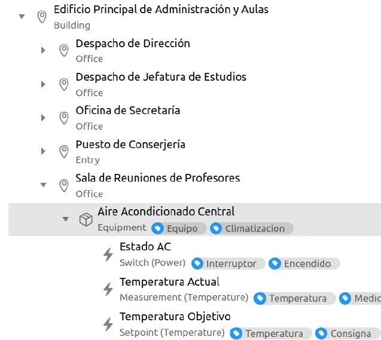

# PlataformaDomotica

## TL;DR (English)

A local LLM (via **Ollama**) drives a home-automation stack (**openHAB**)
through function calling: natural-language commands turn into REST calls
against openHAB items, plus a reactive SSE listener that keeps HVAC in sync
with live sensor events. Built as a hands-on lab around a fictional school
(IES Sequeros). openHAB's admin user and API token are created by you on
first run — nothing is pre-provisioned. Full step-by-step build log (7
phases) in [`docs/guia-practica.md`](docs/guia-practica.md).

## Qué es

Proyecto de integración de un modelo de lenguaje local (LLM) ejecutado con **Ollama** y la plataforma de domótica **OpenHAB**, aplicado a la gestión inteligente de un centro educativo ficticio (IES Sequeros). El sistema permite controlar dispositivos domóticos mediante lenguaje natural, usando *function calling* (tools) y escucha reactiva de eventos SSE.

---

## Arquitectura del Sistema

```
┌─────────────┐     HTTP/REST      ┌──────────────┐
│   Ollama     │◄──────────────────►│   OpenHAB    │
│  (LLM local) │                    │  (Domótica)  │
└──────┬───────┘                    └──────┬───────┘
       │                                   │
       │  Librería ollama (Python)         │  API REST :8080
       │                                   │  SSE /rest/events
       ▼                                   ▼
┌──────────────────────────────────────────────┐
│          Script Python (Middleware)           │
│  - Chat interactivo con ventana de contexto  │
│  - Tools: actuar_openhab, listar_items       │
│  - Hilo SSE: escucha eventos en tiempo real  │
│  - Lógica reactiva de climatización          │
└──────────────────────────────────────────────┘
```

---

## Demo



---

## Requisitos Previos

- **Docker** y **Docker Compose** instalados
- **Ollama** instalado (`curl -fsSL https://ollama.com/install.sh | sh`)
- **Python 3.10+** con pip
- Dependencias Python: `ollama`, `requests`
- Un modelo Ollama con soporte de **tools** (mínimo `qwen3.5:2b`)

---

## Cómo ejecutar

1. Levantar OpenHAB: `docker compose up -d` y esperar ~2 minutos.
2. Abrir `http://localhost:8080` y completar el asistente inicial. **OpenHAB
   crea el usuario admin y permite generar el token API en este primer
   arranque** — no vienen preconfigurados en el repositorio.
3. Copiar `config.example.py` a `config.py` y rellenar `API_TOKEN` con el
   token generado en el paso anterior.
4. Instalar el modelo: `ollama pull qwen3.5:2b`.
5. Ejecutar cualquiera de los scripts, por ejemplo `python scripts/06_reactivo_clima.py`.

Guía completa paso a paso, con el detalle de cada ejercicio (7 fases):
[`docs/guia-practica.md`](docs/guia-practica.md).

---

## Estructura del Proyecto

```
PlataformaDomotica/
├── README.md                    # Este archivo
├── docs/
│   ├── guia-practica.md         # Guía paso a paso completa (7 fases)
│   └── img/domotica.webp
├── compose.yml                  # Docker Compose para OpenHAB
├── config.example.py            # Plantilla de config.py (sin token real)
├── openhab_addons/               # Carpeta para complementos (vacía)
├── openhab_conf/                 # Configuración de OpenHAB (versionada)
│   └── items/
│       └── ies_sequeros.items    # Definición de dispositivos del IES
├── openhab_userdata/              # Datos persistentes de OpenHAB (NO versionado)
├── scripts/
│   ├── 01_chat_basico.py        # Ejercicio 4: Chat con ventana de contexto
│   ├── 02_system_prompt.py      # Ejercicio 5-6: System prompt dinámico desde API
│   ├── 03_tool_luces.py         # Ejercicio 7: Tool de control de luces
│   ├── 04_listener_sse.py       # Ejercicio 10: Listener SSE básico
│   ├── 05_chat_completo.py      # Ejercicio 11: Chat + SSE integrado
│   └── 06_reactivo_clima.py     # Ejercicio 12: Lógica reactiva climatización
└── config.py                    # Variables compartidas (URL, TOKEN, MODELO) — no versionado
```

`openhab_userdata/` lo genera y rellena el propio contenedor de OpenHAB en
el primer arranque (config, cache, claves, base de datos de items...); no
se versiona porque incluye credenciales y estado local.

---

## Licencia

MIT — ver [LICENSE](LICENSE)
